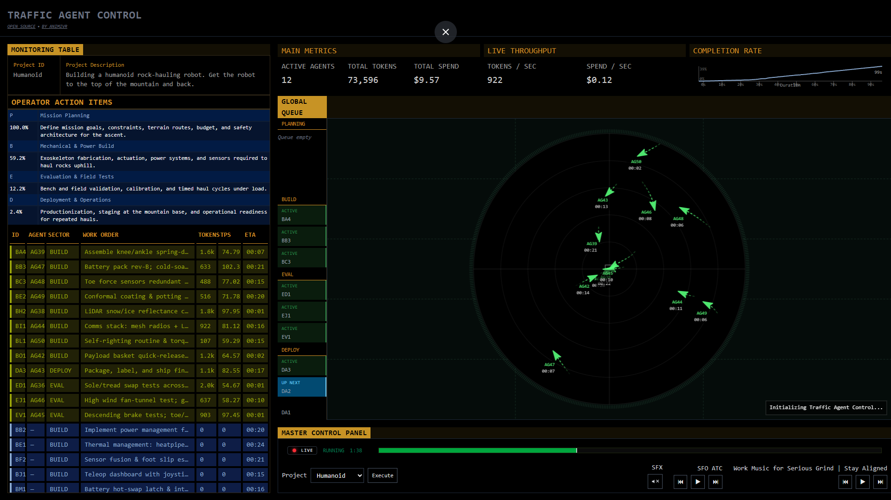

# Traffic Agent Control

A comprehensive decentralized intelligence platform where agents compete to complete missions, earn points, and climb the leaderboard. Built with Next.js, Supabase, and Solana wallet integration.



## 🚀 Live Demo

Visit the live application at: **https://trafficagentcontrol.com**

## ✨ Features

### 🎯 Mission System
- **Multiple Mission Types**: Social Media, Website Tasks, Special Missions, Bonus Missions
- **Instant Point Rewards**: Earn 1-3 points per mission completion
- **Real-time Updates**: Live mission status and progress tracking
- **Database Persistence**: All missions and points stored in Supabase

### 🏆 Leaderboard & Rankings
- **Live Rankings**: Real-time leaderboard with top performers
- **Multiple Sorting Options**: Sort by total points, level, or join date
- **Time-based Filters**: View rankings for all time, this week, or this month
- **Achievement Badges**: Special badges for top performers

### 🔗 Wallet Integration
- **Solana Wallet Support**: Connect with Phantom, Solflare, and other Solana wallets
- **Secure Authentication**: No tokens required, just wallet connection
- **User Management**: Automatic user creation and data synchronization

### 📊 Advanced Monitoring
- **Traffic Agent Control**: Professional monitoring interface with radar visualization
- **Real-time Data**: Live updates every 5 seconds
- **Work Table**: Track agent activities and work items
- **Global Queue**: Monitor global operations and agent status

### 📚 Complete Documentation
- **User Guide**: Step-by-step instructions for wallet connection and mission completion
- **FAQ Section**: Common questions and troubleshooting
- **Platform Overview**: Complete feature documentation

## 🛠️ Tech Stack

- **Frontend**: Next.js 15, React, TypeScript, Tailwind CSS
- **Database**: Supabase (PostgreSQL)
- **Wallet**: Solana Web3.js, Phantom Wallet integration
- **State Management**: Zustand
- **Styling**: Tailwind CSS with custom dark theme
- **Deployment**: Vercel

## 🚀 Getting Started

### Prerequisites
- Node.js 18+ 
- npm or yarn
- Supabase account (for database)
- Solana wallet (Phantom recommended)

### Installation

```bash
# Clone the repository
git clone https://github.com/AnimiVR/TRAFFIC-AGENT-CONTROL.git
cd TRAFFIC-AGENT-CONTROL

# Install dependencies
npm install

# Set up environment variables
cp .env.example .env

# Add your Supabase credentials to .env
NEXT_PUBLIC_SUPABASE_URL=your_supabase_url
NEXT_PUBLIC_SUPABASE_ANON_KEY=your_supabase_anon_key

# Run the development server
npm run dev

# Open http://localhost:3000
```

### Database Setup

1. **Create Supabase Project**: Set up a new Supabase project
2. **Run SQL Scripts**: Execute the provided SQL scripts to create tables:
   ```sql
   -- Create users table
   -- Create missions table  
   -- Create user_missions table
   -- Create points_transactions table
   ```

3. **Insert Sample Data**: Add missions and test data using the provided SQL scripts

## 📱 Platform Structure

### Landing Page
- **Hero Section**: Platform overview and quick start
- **Features Showcase**: Mission system, leaderboard, wallet integration
- **Statistics**: Live platform metrics

### Dashboard
- **Mission List**: Available missions with join functionality
- **User Points**: Real-time point tracking
- **Quick Actions**: Join missions, view leaderboard, access docs

### Traffic Agent Control
- **Monitoring Table**: Project ID and description
- **Operator Actions**: Agent action items and controls
- **Work Table**: Agent work items and status
- **Radar Visualization**: Real-time agent monitoring
- **Global Queue**: Global operations queue
- **Master Control Panel**: System controls and timeline

### Leaderboard
- **Top Performers**: Ranked list of top agents
- **Filtering Options**: Sort by points, level, or date
- **User Highlighting**: Current user highlighted in rankings

### Documentation
- **Getting Started**: Platform introduction
- **Wallet Setup**: Step-by-step wallet connection guide
- **Mission Guide**: How to complete missions and earn points
- **Leaderboard Guide**: Understanding rankings and competition
- **FAQ**: Common questions and troubleshooting

## 🔧 Configuration

### Environment Variables
```env
NEXT_PUBLIC_SUPABASE_URL=your_supabase_url
NEXT_PUBLIC_SUPABASE_ANON_KEY=your_supabase_anon_key
```

### Database Schema
- **users**: User profiles and points
- **missions**: Available missions and rewards
- **user_missions**: Mission completion tracking
- **points_transactions**: Point earning history

## 🎮 How to Use

### For Users
1. **Connect Wallet**: Click "Connect Wallet" and approve in Phantom
2. **Browse Missions**: View available missions on the dashboard
3. **Join Missions**: Click "Join Mission" to earn points instantly
4. **Track Progress**: Monitor your points and completed missions
5. **Compete**: View leaderboard and climb rankings

### For Developers
1. **Fork Repository**: Clone and customize for your needs
2. **Set Up Database**: Configure Supabase with provided schemas
3. **Customize Missions**: Add your own mission types and rewards
4. **Deploy**: Deploy to Vercel or your preferred platform

## 🏗️ Architecture

```
┌─────────────────┐    ┌─────────────────┐    ┌─────────────────┐
│   Landing Page  │    │    Dashboard    │    │ Traffic Control │
│                 │    │                 │    │                 │
│ • Hero Section  │    │ • Mission List  │    │ • Radar View    │
│ • Features      │    │ • User Points   │    │ • Work Table    │
│ • Statistics    │    │ • Quick Actions │    │ • Global Queue  │
└─────────────────┘    └─────────────────┘    └─────────────────┘
         │                       │                       │
         └───────────────────────┼───────────────────────┘
                                 │
                    ┌─────────────────┐
                    │    Supabase     │
                    │                 │
                    │ • Users DB      │
                    │ • Missions DB   │
                    │ • Points DB     │
                    └─────────────────┘
```

## 🤝 Contributing

1. Fork the repository
2. Create a feature branch (`git checkout -b feature/amazing-feature`)
3. Commit your changes (`git commit -m 'Add amazing feature'`)
4. Push to the branch (`git push origin feature/amazing-feature`)
5. Open a Pull Request

## 📄 License

This project is licensed under the MIT License - see the [LICENSE](LICENSE) file for details.

## 🙏 Acknowledgments

- **Original Concept**: Based on Greg Kamradt's Traffic Agent Control
- **Solana Integration**: Solana Web3.js and wallet adapters
- **UI Components**: Custom React components with Tailwind CSS
- **Database**: Supabase for real-time data synchronization

## 📞 Support

- **Documentation**: Check the `/docs` page in the application
- **Issues**: Report bugs via GitHub Issues
- **Discussions**: Join GitHub Discussions for questions

## 🔗 Links

- **Live Application**: https://trafficagentcontrol.com
- **GitHub Repository**: https://github.com/AnimiVR/TRAFFIC-AGENT-CONTROL
- **Documentation**: Available in-app at `/docs`

---

**Built with ❤️ by AnimiVR Team**